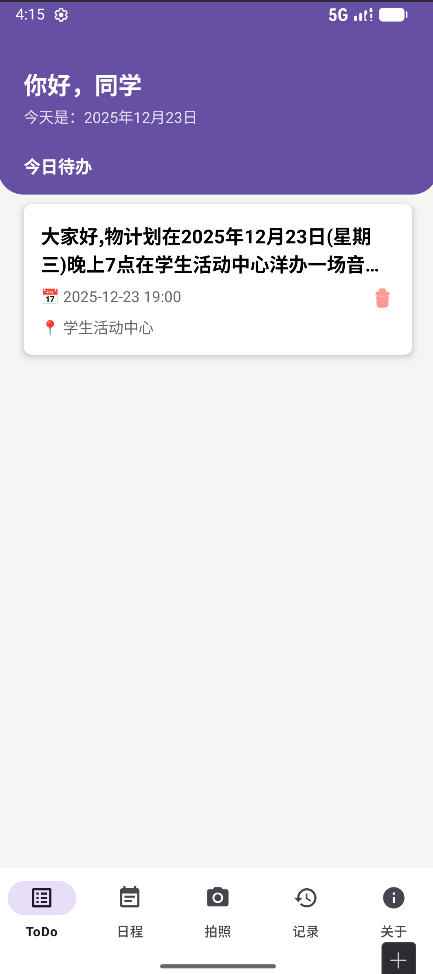
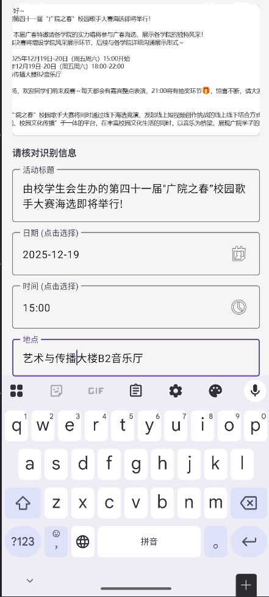
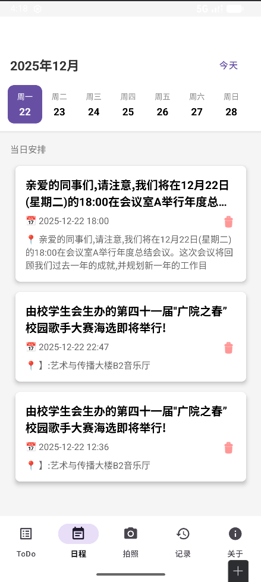
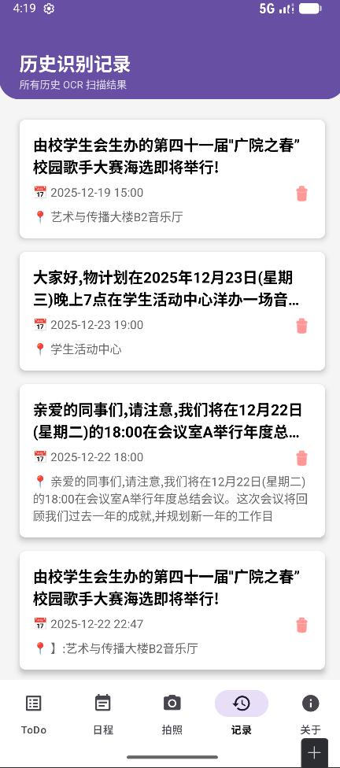

# 📸 PhoToDo - 基于 OCR 的智能日程清单 App


**PhotoDo** 是一款基于 Android 的智能待办事项管理应用。它利用 OCR（光学字符识别）技术，让用户可以通过拍照快速提取传单、通知或海报中的活动信息，并自动解析为结构化的日程安排。

> 🎓 **软件工程结课作业**
> * **开发小组**：软件挖坑王
> * **小组成员(按贡献)**：陈浩东 戴杭 王林立 王子健 余雷 甘思炫 马睿霆
> * **时间**: 2025.12

---

## ✨ 核心功能 (Key Features)

* **📷 智能识图 (Smart OCR)**
    * 集成 Google ML Kit 离线中文模型，毫秒级识别。
    * 自定义 CameraX 相机界面，支持自动对焦与相册导入。
* **🧠 语义解析 (Smart Parser)**
    * 内置正则表达式算法 (`SmartParser`)，自动从杂乱文本中提取 **标题、日期、时间、地点**。
    * 强制格式清洗：自动将各种日期格式转换为标准 `YYYY-MM-DD`。
* **📅 可视化日历 (Calendar View)**
    * 自定义周视图日历，支持点击切换日期。
    * 联动展示当天的待办事项。
* **💾 本地持久化 (Local Storage)**
    * 使用 Android Jetpack Room (SQLite) 数据库。
    * 支持完整的增删改查 (CRUD) 操作与历史记录回溯。
* **🎨 沉浸式 UI**
    * 遵循 Material Design 设计规范。
    * 全屏沉浸式头部设计，完美适配挖孔屏与状态栏。

---

## 🛠️ 技术栈 (Tech Stack)

* **语言**: Kotlin
* **架构**: MVVM 思想 + Single Activity (MainActivity + Fragments)
* **UI 组件**: ViewPager2, RecyclerView, CardView, CoordinatorLayout
* **核心库**:
    * `androidx.room`: 数据库 ORM 框架
    * `androidx.camera`: 相机预览与图像捕获
    * `com.google.mlkit:text-recognition-chinese`: 谷歌机器学习套件（离线版）
    * `org.jetbrains.kotlinx:kotlinx-coroutines`: 协程异步处理

---

## 📱 应用截图 (Screenshots)

|                  首页 (ToDo)                  |                智能解析 (Edit)                |                日历视图 (Calendar)                |                识别记录 (History)                |
| :-------------------------------------------: | :-------------------------------------------: | :-----------------------------------------------: | :----------------------------------------------: |
|  |  |  |  |

---

## 📂 项目结构 (Project Structure)

```text
com.example.photodo
├── db/                     # 数据库层 (AppDatabase, Task, TaskDao)
├── MainActivity.kt         # 主界面容器 (ViewPager2 + BottomNav)
├── CameraActivity.kt       # 自定义相机拍摄页 (CameraX)
├── EditTaskActivity.kt     # 识别结果核对与保存页
├── TodoFragment.kt         # 首页-今日待办
├── CalendarFragment.kt     # 日历页-周视图与日程
├── RecordsFragment.kt      # 记录页-历史识别列表
├── AboutFragment.kt        # 关于页-开发者信息
├── SmartParser.kt          # [核心算法] 正则解析工具类
├── ImageUtils.kt           # 图片压缩与处理工具
├── TaskAdapter.kt          # 任务列表适配器
├── CalendarAdapter.kt      # 日历格子适配器
└── TaskInfo.kt             # 解析结果临时实体
```

